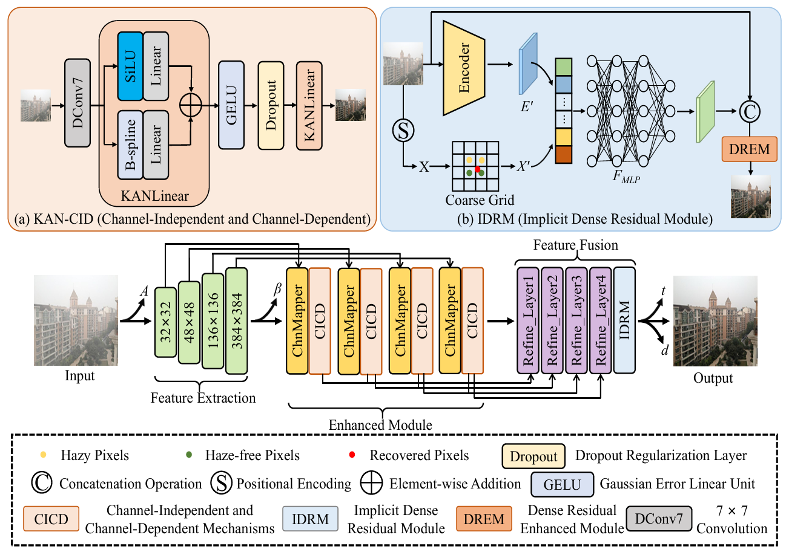

# Learning Implicit Neural Degradation Representation for Unpaired Image Dehazing

Abstract
===========================
 Image dehazing is an important task in the field of computer vision, aiming at restoring clear and detail-rich visual content from haze-affected images. However, when dealing with complex scenes, existing methods often struggle to strike a balance between fine-grained feature representation of inhomogeneous haze distribution and global consistency modeling. Furthermore, to better learn the common degenerate representation of haze in spatial variations, we propose an unsupervised dehaze method for implicit neural degradation representation. Firstly, inspired by the Kolmogorov-Arnold representation theorem, we propose a mechanism combining the channel-independent and channel dependent mechanisms, which efficiently enhances the ability to learn from nonlinear dependencies. Which in turn achieves good visual perception in complex scenes. Moreover, we design an implicit neural representation to model haze degradation as a continuous function to eliminate redundant information and the dependence on explicit feature extraction and physical models. To further learn the implicit representation of the hazefeatures, we also designed a dense residual enhancement module from it to eliminate redundant information. This achieves high-quality image restoration. Experimental results show that our method achieves competitive dehaze performance on various public and real world datasets.



Datasets
===========================
We used [SOTS-indoor](https://sites.google.com/view/reside-dehaze-datasets/reside-v0), [SOTS-outdoor](https://sites.google.com/view/reside-dehaze-datasets/reside-v0),[HSTS](https://sites.google.com/view/reside-dehaze-datasets/reside-v0)  and [I-HAZE](https://data.vision.ee.ethz.ch/cvl/ntire18//i-haze/) for testing. In addition, we also conducted tests on real-world datasets, including PhoneHazy, O-HAZE, and NH-Haze.

For training, we used [ITS](https://sites.google.com/view/reside-dehaze-datasets/reside-standard) dataset, you can follow the operations above to generate the training file lists.

## Training and Test
Training
You can modify the training settings for each experiment in the 'configs.yml'. Then run the following script to train the model：
```
CUDA_VISIBLE_DEVICES=xxxx python train.py --model （Model class） --checkpoints （Training sample address）
```
Testing
Run the following script to test the trained model：
```
CUDA_VISIBLE_DEVICES=XXX python test.py --model （Model class） --checkpoints （Test sample address）
```
## 📊 Results


## Contact
If you have any questions, please contact the email Fansb@stu.cqut.edu.cn
